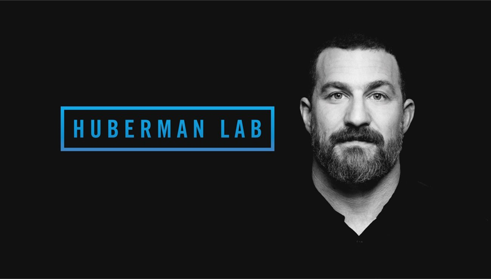
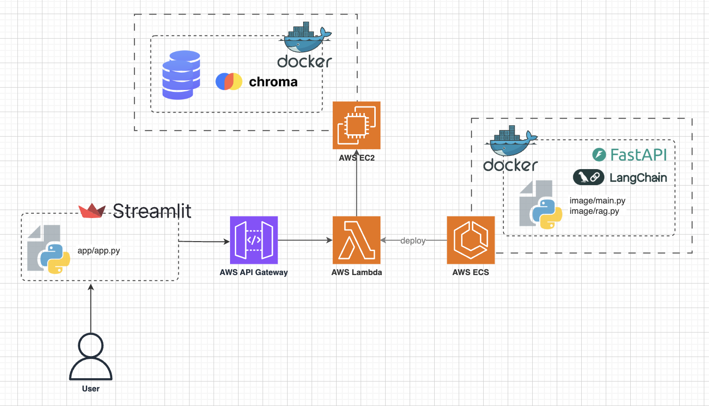

<div align="center">
    
</div>

<p align="center"><h1 align="center">ASK HUBERMAN</h1></p>

A Retrieval Augmented Generation (RAG) system that lets you query the Huberman Lab podcast without listening to every episode. Ask a question to get the answer and relevant episodes. Try the live [demo](https://askhu6erman.streamlit.app/)!


## Project Overview

<div align="center">
    
</div>

* Backend  
    * ChromaDB (vector database) hosted on AWS EC2
    * FastAPI hosted on AWS Lambda  
* Frontend: Built with Streamlit, hosted on Streamlit Cloud
* RAG Logic: Built with Langchain and OpenAI API
---

## Project Structure
```sh
└── HubermanAI/
    ├── README.md
    ├── requirements.txt             
    ├── app                  
    │   ├── api_utils.py
    │   └── app.py
    ├── data                       
    └── image   
        ├── Dockerfile
        ├── config
        ├── utils
        ├── evaluate.py
        ├── main.py                
        ├── rag.py
        └── requirements.txt
```
## About the Dataset

To RAG dataset is transcripts from the Huberman Lab podcast, sourced by scraping YouTube’s auto-generated captions using `Selenium`. Note that accuracy depends on the quality of YouTube’s auto-generated captions.

```bash
python data/get_transcripts.py # creates raw_data.json
```

Then create `train.json` (formatted version of `raw_data.json`), `qna_test.json`, and `syn_test.json` from `raw_data.json`.

```bash
python data/create_dataset.py # creates train.json, qna_test.json, syn_test.json
```

- `train.json`: The primary retrieval dataset for the RAG system.

- `qna_test.json`: A collection of question and supporting document pairs from Q&A sessions of the Huberman Lab podcast. The questions are generated based on answers Andrew Huberman has provided in the podcast, designed to evaluate the RAG system’s generation capabilities.

- `syn_test.json`: Another collection of question and supporting document pairs. Here, the supporting documents are randomly selected from `train.json`, and the questions are generated to be answerable using those documents, intended to evaluate the retrieval performance of the system.

- `relevant_qs.json` & `irrelevant_qs.json`: LLM-generated relevant and irrelevant queries, used to test query retrieval and classify whether a user’s query is valid within the context of the RAG system.

The processed data is stored as embeddings in ChromaDB for efficient retrieval.


##  Installation
To run this project locally, follow these steps:

1. Clone the repository
```bash
git clone https://github.com/Seohyeong/HubermanAI.git
```
2. Install dependencies
```bash
cd HubermanAI
pip install -r requirements.txt
```
3. Set up .env
```
# api keys
OPENAI_API_KEY=XXXX
HF_TOKEN=XXXX

# aws credential
AWS_ACCESS_KEY_ID=XXXX
AWS_SECRET_ACCESS_KEY=XXXX
AWS_DEFAULT_REGION=XXXX

# aws ec2
CHROMA_HOST=XXXX
CHROMA_PORT=XXXX
```

## Deployment

1. Host Chromadb on AWS EC2
```bash
# pull chromadb docker image (on the ec2 instance)
sudo docker pull chromadb/chroma
# run the docker image (on the ec2 instance)
sudo docker run -d -p 8000:8000 -v /home/ubuntu/data:/chroma/chroma chromadb/chroma
# create collections in '/home/ubuntu/datathe' on the ec2 instance (from local)
python data/create_collections.py
```
`create_collections.py` creates two collections on `Chroma`, one for the query validation and one for the response generation.

2. Host RAG API on AWS Lambda

Create a docker image and upload it to AWS ECR. Then create the AWS lambda function with the image on the ECR repository. Then configure an API Gateway to expose the Lambda function’s API as an endpoint.

```bash
cd image
docker build --platform linux/amd64 -t aws_huberman .
```

3. Launch the Streamlit frontend
```bash
cd app
streamlit run app.py
```

## Disclaimer
This project includes an image of Andrew Huberman. I do not own the rights to this image. It is used here for illustrative purposes only.